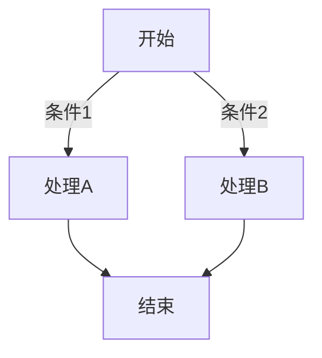
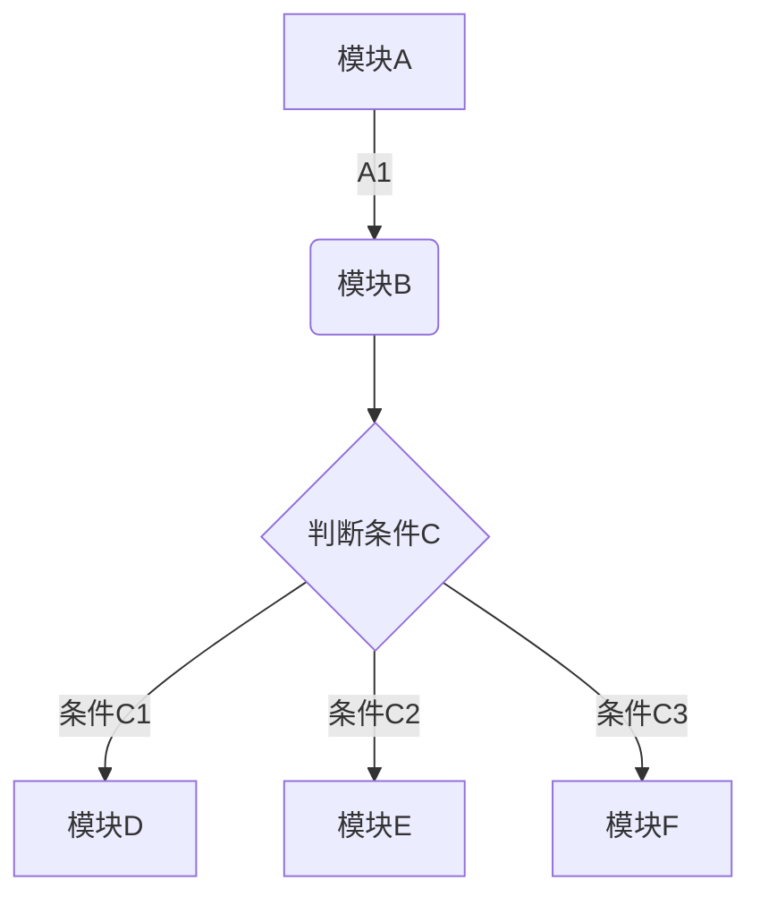
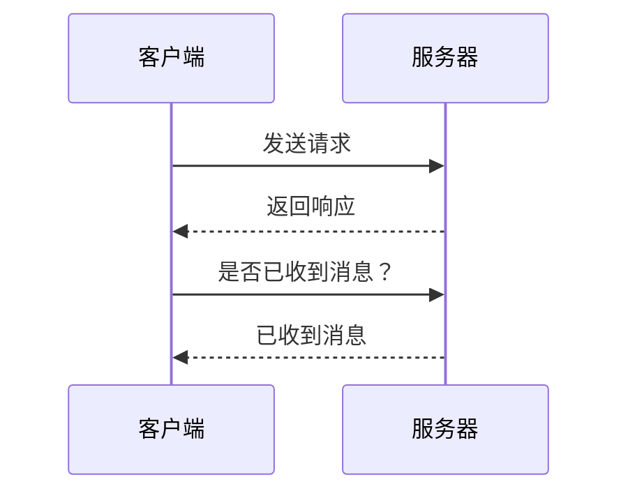
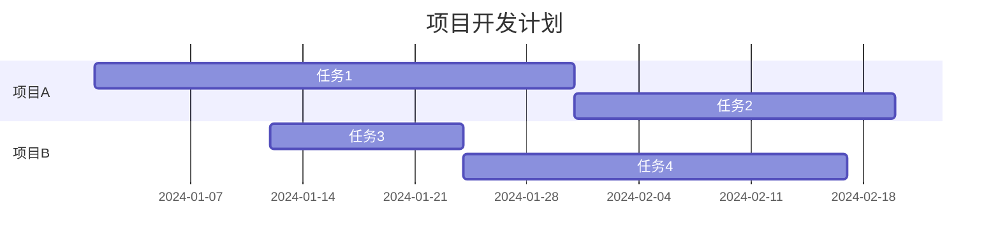

# Markdown 语法指南

## 一、Markdown 概述

::: tip 什么是 Markdown
Markdown 是一种轻量级标记语言，由约翰·格鲁伯（John Gruber）创建。它使用易读易写的纯文本格式编写文档，然后转换成有效的 HTML。

- 文档后缀为 `.md` 或 `.markdown`
- 目前是 GitHub 的御用书写格式
- 弥补了传统纯文本缺少样式的不足
- 降低了传统 Word、HTML 等样式文本的技术门槛
:::

### 1、Markdown 的优势

::: info 核心优势
- ✅ **易读易写**：纯文本格式，无需复杂编辑器
- ✅ **跨平台**：所有平台都支持
- ✅ **版本控制友好**：纯文本易于 Git 管理
- ✅ **广泛支持**：GitHub、GitLab、文档工具都支持
- ✅ **轻量级**：文件体积小，加载快
:::

### 2、Markdown 应用场景

::: details 应用场景
- 📝 **文档编写**：README、API 文档、技术文档
- 📚 **博客写作**：静态博客、技术博客
- 💬 **在线交流**：GitHub Issues、Pull Requests
- 📊 **笔记记录**：个人笔记、会议记录
- 📖 **书籍编写**：电子书、教程编写
:::

## 二、基础语法

### 1、标题

::: tip 标题语法
使用 `#` 号开头，后面至少**一个空格**，对应 HTML 的 H1~H6 标签。
:::

#### 1.1、标题级别

```markdown
# 一级标题
## 二级标题
### 三级标题
#### 四级标题
##### 五级标题
###### 六级标题
```

**效果：**

# 一级标题
## 二级标题
### 三级标题
#### 四级标题
##### 五级标题
###### 六级标题

#### 1.2、标题最佳实践

::: warning 注意事项
- 标题前后建议空一行
- 一级标题通常作为文档标题，不要过度使用
- 保持标题层级结构清晰
:::

### 2、列表

#### 2.1、无序列表

::: tip 无序列表
使用 `*`、`+` 或 `-` 开头，后面至少**一个空格**。三种符号效果相同，建议统一使用一种。
:::

**基本用法：**

```markdown
* 这是第1项
+ 这是第2项
- 这是第3项
```

**效果：**

* 这是第1项
+ 这是第2项
- 这是第3项

**嵌套列表：**

```markdown
* 中国
  * 北京
    * 海淀区
      * 百度
  * 浙江
    * 杭州
      * 阿里巴巴
  * 广东
    * 深圳
      * 腾讯
```

**效果：**

::: details 点击查看嵌套列表效果

* 中国
  * 北京
    * 海淀区
      * 百度
  * 浙江
    * 杭州
      * 阿里巴巴
  * 广东
    * 深圳
      * 腾讯

:::

#### 2.2、有序列表

::: tip 有序列表
使用数字和点号开头，后面至少**一个空格**。数字可以不连续，Markdown 会自动编号。
:::

**基本用法：**

```markdown
1. 这是第1项
2. 这是第2项
3. 这是第3项
```

**效果：**

1. 这是第1项
2. 这是第2项
3. 这是第3项

**嵌套有序列表：**

```markdown
1. 第一项
   1. 第一项的子项
   2. 第一项的子项
2. 第二项
   1. 第二项的子项
```

**效果：**

1. 第一项
   1. 第一项的子项
   2. 第一项的子项
2. 第二项
   1. 第二项的子项

#### 2.3、任务列表

::: tip 任务列表
使用 `- [ ]` 表示未完成任务，`- [x]` 表示已完成任务。方括号内必须是空格或 `x`。
:::

**基本用法：**

```markdown
- [ ] 未完成任务
- [x] 已完成任务
- [ ] 另一个任务
```

**效果：**

- [ ] 未完成任务
- [x] 已完成任务
- [ ] 另一个任务

**实际应用示例：**

```markdown
## 今日待办
- [ ] 完成项目文档
- [ ] 代码审查
- [x] 修复 Bug
- [ ] 更新 README
```

### 3、块引用

::: tip 块引用
使用 `>` 符号表示引用，可以**多层嵌套**。常用于引用他人的话、重要提示等。
:::

#### 3.1、基本引用

```markdown
> 这是一段引用文字
```

**效果：**

> 这是一段引用文字

#### 3.2、多层嵌套

```markdown
> 青玉案·元夕
>> 辛弃疾
>>> 东风夜放花千树。更吹落、星如雨。宝马雕车香满路。凤箫声动，玉壶光转，一夜鱼龙舞。
>>> 蛾儿雪柳黄金缕。笑语盈盈暗香去。众里寻他千百度。蓦然回首，那人却在，灯火阑珊处。
```

**效果：**

> 青玉案·元夕
>> 辛弃疾
>>> 东风夜放花千树。更吹落、星如雨。宝马雕车香满路。凤箫声动，玉壶光转，一夜鱼龙舞。
>>> 蛾儿雪柳黄金缕。笑语盈盈暗香去。众里寻他千百度。蓦然回首，那人却在，灯火阑珊处。

#### 3.3、引用中的其他元素

```markdown
> ## 引用中的标题
> 
> 引用中可以包含：
> 
> 1. 列表
> 2. **粗体**
> 3. `代码`
```

**效果：**

> ## 引用中的标题
> 
> 引用中可以包含：
> 
> 1. 列表
> 2. **粗体**
> 3. `代码`

### 4、字体效果

#### 4.1、基本样式

```markdown
*斜体文字*
**粗体文字**
***粗斜体文字***
~~删除线~~
`行内代码`
```

**效果：**

*斜体文字*
**粗体文字**
***粗斜体文字***
~~删除线~~
`行内代码`

#### 4.2、下划线

::: info HTML 标签
Markdown 本身不支持下划线，但可以使用 HTML 标签实现。
:::

```markdown
<u>下划线文字</u>

<span style="border-bottom:2px dashed yellow;">自定义样式下划线</span>
```

**效果：**

<u>下划线文字</u>

<span style="border-bottom:2px dashed yellow;">自定义样式下划线</span>

#### 4.3、高亮文本

::: tip VitePress 扩展
在 VitePress 中，可以使用 `==高亮文本==` 语法（如果启用）。
:::

```markdown
==高亮文本==
```

**效果：**

==高亮文本==

### 5、代码

#### 5.1、行内代码

```markdown
使用 `git status` 命令查看状态
```

**效果：**

使用 `git status` 命令查看状态

#### 5.2、代码块

```markdown
```javascript
function hello() {
  console.log('Hello, World!');
}
```
```

**效果：**

```javascript
function hello() {
  console.log('Hello, World!');
}
```

#### 5.3、转义反引号

::: tip 转义技巧
如果代码中包含反引号，可以使用双反引号包裹。
:::

```markdown
``Use `code` in your markdown file.``
```

**效果：**

``Use `code` in your markdown file.``

#### 5.4、代码块语法高亮

```markdown
```python
def hello():
    print("Hello, World!")
```

```bash
echo "Hello, World!"
```

```json
{
  "name": "example",
  "version": "1.0.0"
}
```
```

**支持的语言：**
- `javascript` / `js`
- `typescript` / `ts`
- `python` / `py`
- `bash` / `sh`
- `json`
- `html`
- `css`
- `markdown` / `md`
- 等等...

## 三、链接和图片

### 1、超链接

#### 1.1、基本链接

```markdown
[链接文字](链接地址)

[百度](https://www.baidu.com)
```

**效果：**

[百度](https://www.baidu.com)

#### 1.2、带标题的链接

```markdown
[链接文字](链接地址 "鼠标悬停提示")

[百度](https://www.baidu.com "百度一下，你就知道")
```

**效果：**

[百度](https://www.baidu.com "百度一下，你就知道")

#### 1.3、引用式链接

```markdown
[链接文字][链接标识]

[链接标识]: https://www.example.com "可选标题"

[百度][baidu]

[baidu]: https://www.baidu.com "百度一下"
```

**效果：**

[百度][baidu]

[baidu]: https://www.baidu.com "百度一下"

#### 1.4、自动链接

```markdown
<https://www.example.com>
<email@example.com>
```

**效果：**

<https://www.example.com>
<email@example.com>

### 2、图片

#### 2.1、基本图片

```markdown


```

::: info 替代文字
`[ ]` 中的替代文字可以留空，但建议填写，有助于无障碍访问。
:::

#### 2.2、带标题的图片

```markdown


```

#### 2.3、引用式图片

```markdown
![图片替代文字][图片标识]

[图片标识]: https://example.com/image.png "可选标题"
```

#### 2.4、图片链接

```markdown
[](链接地址)

[](https://github.com)
```

**效果：**

[](https://github.com)

### 3、链接到标题

::: tip 锚点链接
可以使用标题的 ID 创建锚点链接，跳转到文档内的指定位置。
:::

```markdown
[跳转到标题](#标题名称)

[跳转到基础语法](#二基础语法)
```

**效果：**

[跳转到基础语法](#二基础语法)

::: warning 注意事项
- 标题中的空格会被替换为 `-`
- 中文标题需要转换为拼音或英文
- 大小写不敏感
:::

## 四、表格

### 1、基本表格

::: tip 表格语法
使用 `|` 分隔单元格，使用 `-` 分隔表头和内容。冒号 `:` 用于控制对齐方式。
:::

```markdown
| 列1 | 列2 | 列3 |
| --- | --- | --- |
| 数据1 | 数据2 | 数据3 |
| 数据4 | 数据5 | 数据6 |
```

**效果：**

| 列1 | 列2 | 列3 |
| --- | --- | --- |
| 数据1 | 数据2 | 数据3 |
| 数据4 | 数据5 | 数据6 |

### 2、表格对齐

```markdown
| 左对齐 | 居中对齐 | 右对齐 |
| :--- | :---: | ---: |
| 数据1 | 数据2 | 数据3 |
| 数据4 | 数据5 | 数据6 |
```

**效果：**

| 左对齐 | 居中对齐 | 右对齐 |
| :--- | :---: | ---: |
| 数据1 | 数据2 | 数据3 |
| 数据4 | 数据5 | 数据6 |

### 3、表格中的其他元素

```markdown
| 功能 | 语法 | 示例 |
| --- | --- | --- |
| 粗体 | `**文字**` | **粗体** |
| 斜体 | `*文字*` | *斜体* |
| 代码 | `` `代码` `` | `代码` |
| 链接 | `[文字](链接)` | [链接](https://example.com) |
```

**效果：**

| 功能 | 语法 | 示例 |
| --- | --- | --- |
| 粗体 | `**文字**` | **粗体** |
| 斜体 | `*文字*` | *斜体* |
| 代码 | `` `代码` `` | `代码` |
| 链接 | `[文字](链接)` | [链接](https://example.com) |

::: warning 注意事项
- 冒号 `:` 两侧需要**至少一个空格**，否则会被识别为任务列表
- 表格前后建议空一行
- 表格内容过长时，建议使用 HTML 表格
:::

## 五、分割线

### 1、基本分割线

```markdown
---

***

___
```

**效果：**

---

***

___

### 2、HTML 分割线

```markdown
<hr>

<hr style="border: 1px solid red;">
```

**效果：**

<hr>

<hr style="border: 1px solid red;">

::: tip 分割线规则
- 至少三个连续的 `-`、`*` 或 `_`
- 可以包含空格，如 `- - -`
- 前后建议空一行
:::

## 六、高级语法

### 1、脚注

::: tip 脚注
脚注是对文本的补充说明，可以放在文章的任意位置，并不要求一定要放在文末。
:::

```markdown
这是一个简单的脚注[^1]，这是一个更长的脚注[^2]。

[^1]: 这是第一个脚注的内容
[^2]: 这是第二个脚注的内容，可以包含多行文字。
```

**效果：**

这是一个简单的脚注[^1]，这是一个更长的脚注[^2]。

[^1]: 这是第一个脚注的内容
[^2]: 这是第二个脚注的内容，可以包含多行文字。

### 2、转义字符

::: info 转义
使用反斜杠 `\` 可以转义 Markdown 的特殊字符。
:::

```markdown
\* 这不是列表项
\# 这不是标题
\[这不是链接\]
```

**效果：**

\* 这不是列表项
\# 这不是标题
\[这不是链接\]

**需要转义的字符：**
- `\` 反斜杠
- `` ` `` 反引号
- `*` 星号
- `_` 下划线
- `{}` 花括号
- `[]` 方括号
- `()` 圆括号
- `#` 井号
- `+` 加号
- `-` 减号
- `.` 点号
- `!` 感叹号

### 3、HTML 标签

::: tip HTML 支持
Markdown 支持在文档中使用 HTML 标签，但要注意安全性。
:::

```markdown
<div style="color: red;">红色文字</div>

<kbd>Ctrl</kbd> + <kbd>C</kbd>

<mark>高亮文本</mark>
```

**效果：**

<div style="color: red;">红色文字</div>

<kbd>Ctrl</kbd> + <kbd>C</kbd>

<mark>高亮文本</mark>

## 七、Mermaid 图表

### 1、流程图

::: tip Mermaid 支持
Mermaid 是一个用于创建图表和流程图的语言，许多 Markdown 编辑器都支持。
:::

````markdown

````

**效果：**


#### 1.1、流程图示例

````markdown

````

**效果：**


### 2、时序图

````markdown

````

**效果：**


### 3、甘特图

````markdown

````

**效果：**


### 4、其他图表类型

::: details 更多 Mermaid 图表类型

- **类图**：`classDiagram`
- **状态图**：`stateDiagram`
- **ER 图**：`erDiagram`
- **饼图**：`pie`
- **Git 图**：`gitGraph`
- **用户旅程图**：`journey`

:::

## 八、徽章和装饰

### 1、什么是徽章

::: tip 徽章
徽章是一种小巧精美的图标，一般配有相关文字进行辅助说明，可对数据进行监控，链接跳转等，富有表现力。常用于 README 文件中展示项目状态。
:::

### 2、徽章的使用

#### 2.1、基本格式

```markdown
[](超链接地址)
```

#### 2.2、常见徽章示例

```markdown


```

**效果：**


### 3、徽章生成网站

::: info 推荐工具
- **[Shields.io](https://shields.io)**：最流行的徽章生成网站
- **[Badgen](https://badgen.net/)**：快速徽章生成
- **[For the Badge](https://forthebadge.com/)**：装饰性徽章
:::

### 4、README 文档模板

::: tip 模板工具
- **[readme.so](https://readme.so/)**：交互式 README 生成器
- **[GitHub Profile README Generator](https://rahuldkjain.github.io/gh-profile-readme-generator/)**：GitHub 个人主页生成器
:::

## 九、VitePress 扩展语法

### 1、自定义容器

::: tip 提示容器
这是 VitePress 的 tip 容器
:::

::: info 信息容器
这是 VitePress 的 info 容器
:::

::: warning 警告容器
这是 VitePress 的 warning 容器
:::

::: danger 危险容器
这是 VitePress 的 danger 容器
:::

::: details 详情容器
这是 VitePress 的 details 容器，可以折叠内容。
:::

### 2、代码组

::: code-group

```js [JavaScript]
console.log('Hello, World!');
```

```ts [TypeScript]
console.log('Hello, World!');
```

```py [Python]
print('Hello, World!')
```

:::

### 3、数学公式

::: tip 数学公式
VitePress 支持 LaTeX 数学公式（需要配置）。
:::

```markdown
行内公式：$E = mc^2$

块级公式：
$$
\sum_{i=1}^{n} i = \frac{n(n+1)}{2}
$$
```

## 十、最佳实践

### 1、文档结构

::: tip 结构建议
- 使用清晰的标题层级
- 保持段落简洁
- 合理使用列表和表格
- 添加必要的代码示例
:::

### 2、代码规范

::: info 代码建议
- 使用语法高亮
- 添加必要的注释
- 保持代码简洁
- 使用代码块而非行内代码展示多行代码
:::

### 3、链接管理

::: warning 链接注意事项
- 使用相对路径引用本地资源
- 外部链接使用 HTTPS
- 定期检查链接有效性
- 为图片添加替代文字
:::

### 4、可读性优化

::: details 可读性技巧
- 使用空行分隔段落
- 合理使用列表和表格
- 避免过长的行（建议 80-100 字符）
- 使用标题组织内容
- 添加目录导航
:::

## 十一、常用工具

### 1、Markdown 编辑器

::: info 推荐编辑器
- **Typora**：所见即所得编辑器
- **Mark Text**：开源 Markdown 编辑器
- **Obsidian**：知识管理工具
- **VS Code**：配合 Markdown 扩展
- **Notion**：在线协作工具
:::

### 2、在线工具

::: details 在线工具列表
- **[StackEdit](https://stackedit.io/)**：在线 Markdown 编辑器
- **[Dillinger](https://dillinger.io/)**：在线 Markdown 编辑器
- **[Markdown Preview Enhanced](https://shd101wyy.github.io/markdown-preview-enhanced/)**：VS Code 扩展
- **[Table Generator](https://www.tablesgenerator.com/markdown_tables)**：表格生成器
:::

### 3、转换工具

::: tip 转换工具
- **Pandoc**：文档格式转换工具
- **Markdown to PDF**：转换为 PDF
- **Markdown to HTML**：转换为 HTML
:::

## 十二、总结

### 1、Markdown 核心语法

| 功能 | 语法 |
|------|------|
| 标题 | `# 标题` |
| 粗体 | `**文字**` |
| 斜体 | `*文字*` |
| 链接 | `[文字](链接)` |
| 图片 | `` |
| 代码 | `` `代码` `` |
| 列表 | `- 项目` |
| 引用 | `> 引用文字` |
| 表格 | `\| 列1 \| 列2 \|` |


### 2、学习资源

::: details 推荐资源
- 📚 **官方文档**：https://daringfireball.net/projects/markdown/
- 🎓 **Markdown 教程**：https://www.markdowntutorial.com/
- 📖 **Markdown 指南**：https://www.markdownguide.org/
:::
